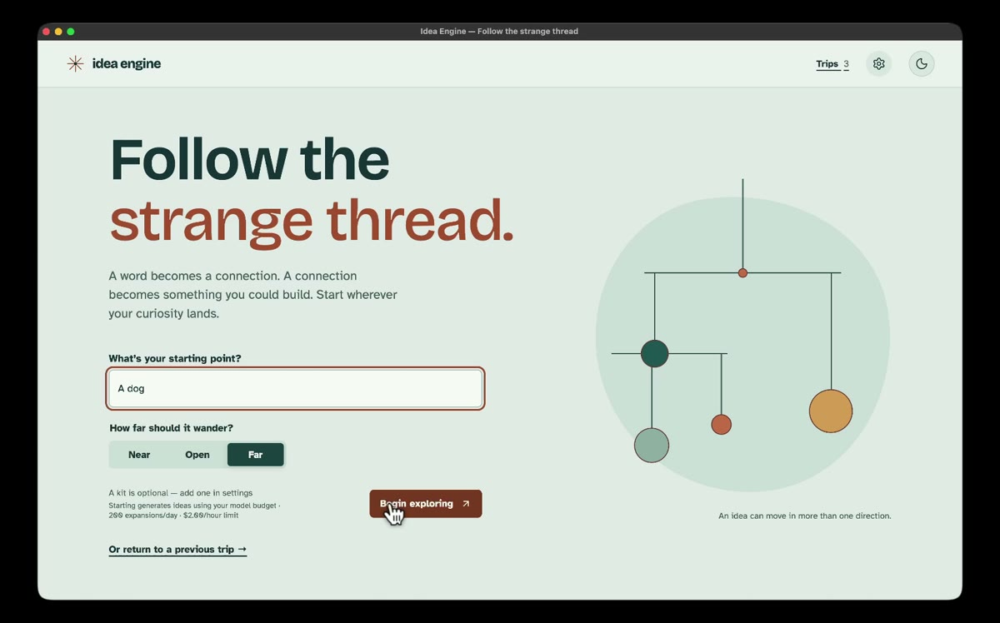

# Idea Engine

**Follow the strange thread.** Start with a word, wander through unexpected connections, and turn the best one into something you could build.

[](teaser.mp4)

**[▶ Watch the 47-second teaser](teaser.mp4)**

## How it works

1. **Start anywhere.** Enter a seed and choose how far the ideas should wander: Near, Open, or Far. Add an optional kit of materials or tools you have on hand.
2. **Follow a branch.** Explore associations on a visual map, retrace your path, and pick the next idea to develop. Jev filters generated suggestions before they appear.
3. **Keep what clicks.** Pin an idea to make a concept card with its origin story, rough stack, smallest prototype, and a wildcard. Copy it as Markdown or a coding-agent prompt.

Trips and concepts are saved locally, so you can come back to a thread later.

## Run it locally

You'll need [Docker](https://docs.docker.com/get-docker/) and your own [OpenRouter API key](https://openrouter.ai/settings/keys).

```sh
git clone https://github.com/somaticbits/idea-engine.git
cd idea-engine
docker compose up --build
```

Open **http://127.0.0.1:8080** and paste your key into the setup screen. The app checks that the key can access both chat and Jev. Your trips are stored in a local Docker volume; stop the app with `Ctrl+C`.

For local development instead, use Node 22 and run `npm ci` followed by `npm run dev`. Open **http://127.0.0.1:5173**.

## Before you explore

- Model calls use your OpenRouter credits, including setup checks and retries. Set a spending limit on your key. The app also defaults to **200 expansions/day**, **30 pins/day**, and **$2/hour** in budgeted spend; its estimate is not your OpenRouter bill.
- This is a **single-user, loopback-only** app with no login. Don't expose port 8080 to your network. Seeds, kit items, and graph context are sent to OpenRouter and its serving providers when generating ideas.
- The browser doesn't call OpenRouter directly; the local server handles requests and stores your work. No analytics are included.

[MIT license](LICENSE) · [Security](SECURITY.md)
